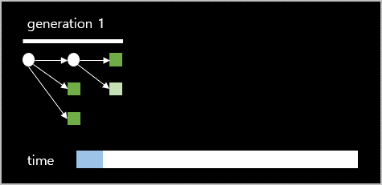
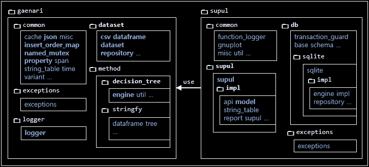
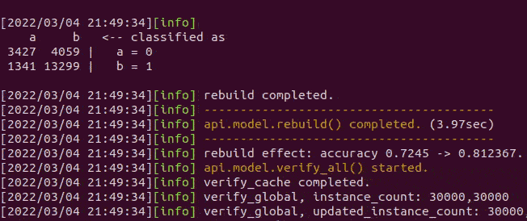
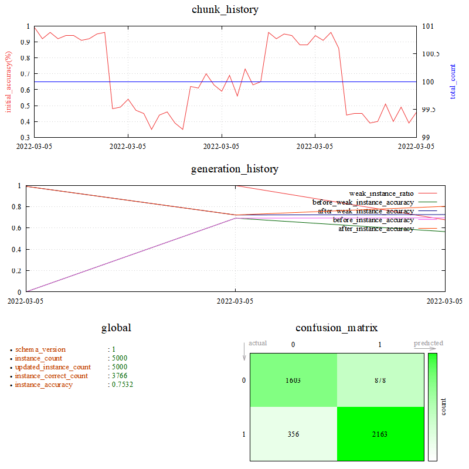
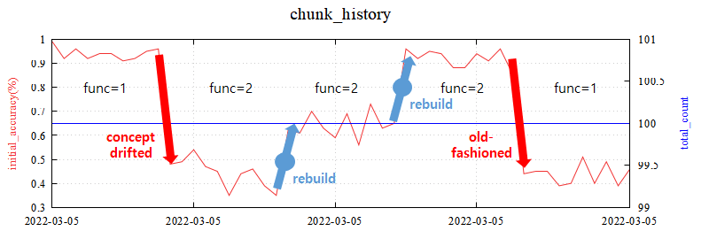
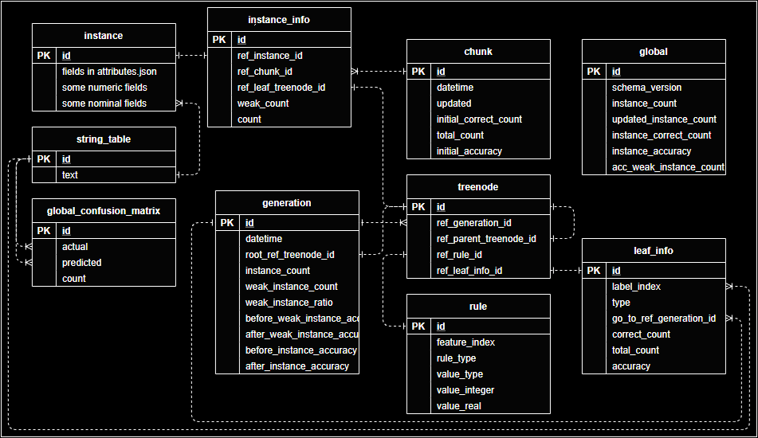
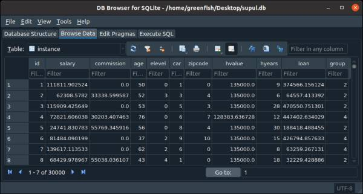
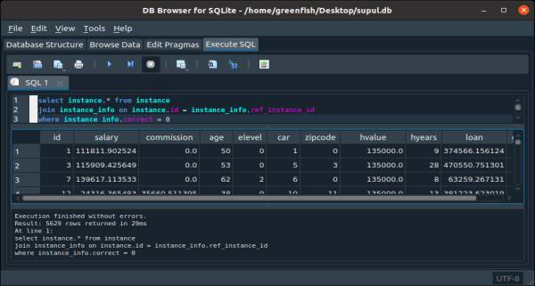
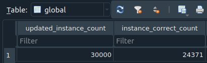
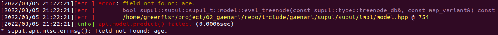

gaenari
=======

`gaenari` is the Korean name for spring-blooming `forsythia` in East Asia. it is a plant with small yellow flowers.\


Here, `gaenari` means:
- full project name with C++17 header-only libraries.
- a single `decision tree` like [`ID3`](https://en.wikipedia.org/wiki/ID3_algorithm) and [`C4.5`](https://en.wikipedia.org/wiki/C4.5_algorithm).

when `machine learning` works with real world data, its **accuracy decreases over time**. it is quite different from the AI industry news or the success stories of academic journals. what is the cause of the problem?

### concept drift

[**`concept drift`**](https://en.wikipedia.org/wiki/Concept_drift) is one of the biggest obstacles of machine learning in the real world AI.

can data before the `COVID-19` pandemic predict future information? not easy. because data trends are always changing, so current models cannot easily predict the future one step ahead.

> we live in an incomplete `real world` rather than a `toy world` that separates dog and cat images.

### solutions

- assume that perfect modeling is impossible.\
  it relies on `heuristic technique` instead of mathemetical and statistical algorithms.
- update the model through [**`incremental learning`**](https://en.wikipedia.org/wiki/Incremental_learning).
- accumulate data and provide insights.
- minimize the use of complex hyper-parameters.

[**this is an example**](#chunk_history_trend) of resolving the decrease in accuracy due to data trend change by calling `rebuild()`.

### supul

**`supul`** means forest in Korean, and it is a metaphor for multiple decision trees.
`supul` is the another library in `gaenari`.

- support for `incremental learning` through `inserts`, `updates`, and `rebuilds`.
- combine multiple `decision trees`.
- manage a database.

### generation

the `supul` expands by `generation`. `rebuild` trains a single `decision tree` on the weak parts and then combine it.

\


the goal is to increase(or keep) accuracy through rule segmentation.
similar to the effect of sharpening a photo as shown in the picture below.


### i learned that overfitting is bad.

as above, the tree seems to overfit over time. so it is true that negative thoughts arise.

in traditional machine learning, the training data is a sampled subset of the population. so there is a sampling error(the training data are not representative of all cases in the population), overfitting is the target of avoidance.

however, the goal of the `supul` is to learn the whole data, not the samples.
therefore, in this case, it adaps to new data through continous `incremental learning`. this reduces the risk of overfitting.

### library design



a single `decision tree` and `dataset` are implemented in `gaenari`.
`supul` implements a public supul methods that can be called externally.
database and model processing for incremental learning are key.

dataframe repository is implemented as an interface and can be easily appended to. the same goes for databases.
databases other than sqlite are also possible.

### build

`gaenari` is a header-only library, so only include is needed.
but some external libraries, such as sqlite, require c/c++ compilation for link.

#### build `gaenari`

```bash
$ cd /path/to/gaenari
$ mkdir build
$ cd build
$ cmake ..
$ cmake --build . --config release
```

#### test

```bash
$ ctest --verbose
```

find executables in build/tests/* and just execute it, display in color.



#### build with `gaenari`

##### wrapper/wrapper.cpp

```c++
#include "gaenari/gaenari.hpp"
int main(void) {
    gaenari::logger::init1("/temp/_log.txt");
    using supul_t = supul::supul::supul_t;
    supul_t::api::project::create("/temp/supul_dir");
    supul_t::api::project::add_field("/temp/supul_dir", "x1", "REAL");
    supul_t::api::project::add_field("/temp/supul_dir", "x2", "INTEGER");
    supul_t::api::project::add_field("/temp/supul_dir", "x3", "TEXT_ID");
    supul_t::api::project::add_field("/temp/supul_dir", "y0", "TEXT_ID");
    supul_t::api::project::x("/temp/supul_dir", {"x1", "x2", "x3"});
    supul_t::api::project::y("/temp/supul_dir", "y0");
    supul_t::api::project::set_property("/temp/supul_dir", "db.type", "sqlite");
    supul_t supul;
    supul.api.lifetime.open("/temp/supul_dir");
    supul.api.model.insert_chunk_csv("/temp/dataset.csv");
    supul.api.model.update();
    // ...
    supul.api.model.rebuild();
    supul.api.lifetime.close();
    return 0;
}
```

##### wrapper/CMakeLists.txt

```cmake
cmake_minimum_required(VERSION 3.6)
project(wrapper)

# call order is important.

add_subdirectory(</path/to/gaenari>)
check_cpp17_gaenari()

add_executable(wrapper wrapper.cpp)
add_gaenari(wrapper)
```

##### build

```bash
wrapper/build$ cmake ..
wrapper/build$ cmake --build . --config release
```

### walkthrough

you can call supul.api.\<*category*>.\<*function*>(...).
it is implemented as noexcept, so checks for errors by
checking the return `false`(or `std::nullopt`). for convenience, the return value check is omitted.
see comments for more details.

#### walkthrough :: ready

since `gaenari` has only headers, a single include is required.

```c++
#include "gaenari/gaenari.hpp"
```

initialize log:
```c++
gaenari::logger::init1("/temp/log_gaenari.log");
```

#### walkthrough :: project

`supul` runs as a project in a directory unit.
the project directory contains configuration, and sqlite database files.
the project creation is as follows.
```c++
supul::supul::supul_t::api::project::create("/temp/my_project");
```

all functions in project category are static, so they can be called directly without an object.
the main files in the project directory are:


|file name      |note                 |
|---------------|---------------------|
|property.txt   |project configuration|
|attributes.json|schema definition    |
|*.db           |sqlite database file |

##### /temp/my_project/property.txt

```ini
# supul configuration.
ver = 1.0.0
# supported db type : sqlite.
db.type = sqlite
# set default database name.
db.dbname = supul
# set table name prefix.
db.tablename.prefix = 
# if the treenode is less accurate(<=) than this value, it is weak. the higher value, the more aggresive rebuild, and the more complex the tree.
model.weak_treenode_condition.accuracy = 0.8
# it is weak when the number of treenode's instances is greater(>=) than this. the lower value, the more aggresive rebuild, and the more complex the tree.
model.weak_treenode_condition.total_count = 5
```

you must choose **`db.type`** after project_create().
for example, select `sqlite`.
you can edit manually or fix it using following function.
```c++
supul::supul::supul_t::api::project::set_property("/temp/my_project",
                                                  "db.type",
                                                  "sqlite");
```

##### attributes.json

```json
{
	"revision": 0,
	"fields": {
		"salary": "REAL",
		"commission": "REAL",
		"age": "INTEGER",
		"elevel": "TEXT_ID",
		"car": "TEXT_ID",
		"zipcode": "TEXT_ID",
		"hvalue": "REAL",
		"hyears": "INTEGER",
		"loan": "REAL",
		"group": "TEXT_ID"
	},
	"x": [
		"salary",
		"commission",
		"age",
		"elevel",
		"car",
		"zipcode",
		"hvalue",
		"hyears",
		"loan"
	],
	"y": "group"
}
```

the above json is an example of [`agrawal dataset`](https://weka.sourceforge.io/doc.dev/weka/datagenerators/classifiers/classification/Agrawal.html).
it is created with the dataset generator provided by [`weka`](https://www.cs.waikato.ac.nz/ml/weka/) and divided into two groups.
there are 9 `function`s and the same `function` have the same data trend. used for `concept drift` experiments.

`INTEGER`, `REAL`, and `TEXT_ID` are supported as data types.
`TEXT_ID` use index stored in a `string table`.
it is `nominal` data.

these fields should be included in the header of the csv where the instances are stored.
not all fields need to be included in x(e.g. internal id values needed for tracking).
explicitly determines the x items in the fields. and choose one y item as well.

you can edit the json manually or use the function below, too.


```c++
using supul_t = supul::supul::supul_t;
std::string base_dir = "/temp/my_project";

supul_t::api::project::add_field(base_dir, "salary",     "REAL");
supul_t::api::project::add_field(base_dir, "commission", "REAL");
...
supul_t::api::project::add_field(base_dir, "group",      "TEXT_ID");

supul_t::api::project::x(base_dir, {"salary", "commission", ..., "loan"});
supul_t::api::project::y(base_dir, "group");
```

#### walkthrough :: create a supul object

after project creation, create a `supul` object.

```c++
supul::supul::supul_t supul;
```

if you want to use a supul object as a function return, you can use `unique_ptr`.

```c++
auto supul = std::make_unique<supul::supul::supul_t>();
...
return supul;
```

we can get `supul` api hints from ide tools (ex, visual studio).


you can use the lifetime api to open and close your project.

```c++
supul.api.lifetime.open("/temp/my_project");
```

#### walkthrough :: insert a csv file

`supul` supports `incremental learning`. train a continuous dataset, and one dataset is called a **`chunk`**.

prepare the csv in the same format as the definition in attributes.json.

salary|commision|age|elevel|car|zipcode|hvalue|hyears|loan|group
------|---------|---|------|---|-------|------|------|----|-----
111811.9025|0|50|L2|C16|Z2|135000|9|374566.1561|G1
62308.5782|33338.59959|52|L3|C3|Z0|135000|6|64557.41339|G1
...|...|...|...|...|...|...|...|...|...
> when creating a csv with weka, elevel, car, zipcode, and group are expressed
only as numbers(actually nominal).

we can create agrawal dataset.csv as below.

```bash
$ java -classpath weka.jar weka.datagenerators.classifiers.classification.Agrawal -r temp -S 0 -n 100 -F 0 -P 0.005 > dataset.arff
$ java -classpath weka.jar weka.core.converters.CSVSaver -i data.arff -o dataset.csv
```
(see create_agrawal_dataset() function.)

insert an instances in csv into the database.
```c++
supul.api.model.insert_chunk_csv("/temp/dataset.csv");
```

> `supul` inserts all new in-comming data into database. therefore,
the database size is continuously increasing. it requres techniques to keep it
on a limited scale. it is in TO-DO.

#### walkthrough :: update

`insert` stores only instance data, so we need to call `update()` for the next step.
the update information includes things like the evaluation results for the current model.
so, unlike `insert`, `update` requires extra time.

```c++
supul.api.model.update();
```

> when update is called, the first model training will automatically proceed if the model has not yet been built.

update also stores statistical data(accuracy, etc.) for each `chunk`. this allows you to see how well the currently trained model reflects the new `chunk`.

#### walkthrough :: rebuild

when the trend in the data changes, the accuracy of the `chunks` decreases.
`rebuild()` finds weak instances, re-trains only those parts, and combines
them with the existing tree to overcome the loss of accuracy.

```c++
supul.api.model.rebuild();
```

> if the `rebuild` results  in somewhat less accurate, rollback to the previous state.

> `rebuild` increases the size of the model because it is a continous method
of combining models. the way to maintain a limited scale is included in TO-DO.

> `reubild` is not yet automatically invoked by trigger.
the call to `rebuild` under certain conditions is not yet implemented.

#### walkthrough :: predict

predict the y value of the x parameters that is input to the current model.
the previous model is used by database transactions when changes
(insert, update, rebuild, etc.) are currently in progress.
a map of (key, value) is used for the x parameter, where key
and value are strings. value is automatically converted by attributes.json.

```c++
std::unordered_map<std::string, std::string> x;
x = {{"salary",    "1000.0"},
     {"commision", "0.0"},
     {"age",       "25"},
     {"elevel",    "3"},
     {"car",       "1"},
     {"zipcode",   "1"},
     {"hvalue",    "132000"},
     {"hyears",    "3"}};
auto ret = supul.api.model.predict(x);
```

returned information of predict:

```c++
// predict result.
struct predict_result {
	bool		error = false;
	std::string	errormsg;
	int64_t		label_index = 0;
	std::string	label;
	int64_t		correct_count = 0;
	int64_t		total_count = 0;
	double		accuracy = 0.0;
};
```

the `label` value is the predicted y value. `label_index` is the string table index of the `label`.
`correct_count`, `total_count`, and `accuracy` are information of the leaf tree node
classified in the decision tree.
> these three values can be used as confidence information
for prediction.

#### walkthrough :: report

current status can be output as `json` and `gnuplot` charts.

> install `gnuplot` and add to path.

to get report as json:
```c++
auto ret = supul.api.report.json("");
if (not ret) {/* error */}
auto& json = ret.value();
```

to get report as gnuplot (png):
```c++
supul.api.report.gnuplot(json, {
	{"terminal",		"pngcairo"},
	{"terminal_option",	"font `Times-New-Roman,10` size 800,800"},
	{"output_filepath",	"/tmp/chart.png"},
	{"plt_filepath",	"/tmp/gnuplot_script.plt"},
});
```

> see configuring `gnuplot` for `terminal` and `terminal option`.
> if the terminal is `dumb`, it will output an ascii chart.

pretty processed json:
```json
{
  "doc_ver": 1,
  "error": false,
  "category": {
    "global": {
      "schema_version": 1,
      "instance_count": 5000,
      "updated_instance_count": 5000,
      "instance_correct_count": 3766,
      "instance_accuracy": 0.7532,
      "acc_weak_instance_count": 4029
    },
    "confusion_matrix": {
      "label_name": [
        "1",
        "0"
      ],
      ...
```

chart.png:



> `chunk_history` allows you to see the current accuracy trend of the model and
call `rebuild` if necessary for better accuracy.

<a name="chunk_history_trend"></a>
the `chunk_history` above is the result of \_develop.hpp::report().
it processed in the following order(agrawal dataset).
1. insert and update 10 chunks (**func=1**)
2. insert and update 10 chunks (**func=2**)
3. rebuild
4. insert and update 10 chunks (**func=2**)
5. rebuild
6. insert and update 10 chunks (**func=2**)
7. insert and update 10 chunks (**func=1**)



gnuplot_script.plt

```
# ${SET_TERMINAL}

# common

# data block
$data_block_chunk_history << EOD
0 0.99 100
...
# multiplot: chunk_history
set origin 0, 0.67
set size 1, 0.34
...
reset
unset key
unset multiplot
```

> `gnuplot`'s script leaves the `terminal` configuration blank to use the system
defaults. set it yourself if necessary.

#### walkthrough :: wrap-up

##### stage 1: create a project that calls only once at the start.

```c++
#include "gaenari/gaenari.hpp"
...
gaenari::logger::init1("/temp/log_gaenari.log");
std::string base_dir = "/temp/my_project";
supul::supul::supul_t::api::project::create(base_dir);
supul::supul::supul_t::api::project::set_property(base_dir, "db.type", "sqlite");
supul::supul::supul_t::api::project::add_field(base_dir, "salary",     "REAL");
supul::supul::supul_t::api::project::add_field(base_dir, "commission", "REAL");
supul::supul::supul_t::api::project::add_field(base_dir, "group",      "TEXT_ID");
// ... omit ...
supul::supul::supul_t::api::project::x(base_dir, {"salary", "commission", ..., "loan"});
supul::supul::supul_t::api::project::y(base_dir, "group");
```

##### stage 2: continuous insert of new data(`chunks`).

```c++
#include "gaenari/gaenari.hpp"
...
gaenari::logger::init1("/temp/log_gaenari.log");
supul::supul::supul_t supul;
supul.api.lifetime.open("/temp/my_project");
supul.api.model.insert_chunk_csv("/temp/dataset1.csv");
supul.api.model.update();
supul.api.model.insert_chunk_csv("/temp/dataset2.csv");
supul.api.model.update();
supul.api.model.insert_chunk_csv("/temp/dataset3.csv");
supul.api.model.update();
```

##### stage 3: predict a instance.

```c++
#include "gaenari/gaenari.hpp"
...
std::unordered_map<std::string, std::string> instance = {{"salary":"3"}, ...};
...
gaenari::logger::init1("/temp/log_gaenari.log");
supul::supul::supul_t supul;
supul.api.lifetime.open("/temp/my_project");
auto ret = supul.api.model.predict(instance);
auto& predicted = ret.label;
```

##### stage 4: rebuild due to data trend change.

```c++
#include "gaenari/gaenari.hpp"
...
gaenari::logger::init1("/temp/log_gaenari.log");
supul::supul::supul_t supul;
supul.api.lifetime.open("/temp/my_project");
supul.api.model.rebuild();
```

##### stage 5: analyze the report.

```c++
#include "gaenari/gaenari.hpp"
...
gaenari::logger::init1("/temp/log_gaenari.log");
supul::supul::supul_t supul;
supul.api.lifetime.open("/temp/my_project");
auto ret = supul.api.report.json("");
if (not ret) {/* error */}
auto& json = ret.value();
supul.api.report.gnuplot(json, {
	{"terminal",		"pngcairo"},
	{"terminal_option",	"font `Times-New-Roman,10` size 800,800"},
	{"output_filepath",	"/tmp/chart.png"},
	{"plt_filepath",	"/tmp/gnuplot_script.plt"},
});
```

### database

database is at the heart of `supul`. so, it is helpful to understand the database structure.

er-diagram:\


* the primary key for all tables is `id`.
* fields in the `instance` table are dynamically determined by `attributes.json`.
* fields with `*ref_*` are references to other table `id`.
* implementations that rely on specific database are prohibited.
* fields used in the `where` clause are added to the index.
* numerous `treenode` queries are required while running `predict`. so the `cache` is used for performance.
* use `prepared statements` for security and performance.

a tool like [DB Browser for SQLite](https://sqlitebrowser.org) makes it easier to understand the structure.

\
the sqlite database file with extension .db is located under the project directory.
the agrwal instances are in the `instance` table.

#### let's look for misclassified instances.

execute this query:
```sql
select instance.*
  from instance
  join instance_info on instance.id = instance_info.ref_instance_id
where  instance_info.correct = 0
```

\
5629 instances were found (id: 1, 3, 7, ...).

\
30000 - 24371 = 5629, matches the calculation result of the global value.

### error handling

the `supul` api in `api` category is a noexcept function, so no exceptions are thrown.
check for errors with the return value.

|return type  |error       |
|-------------|------------|
|bool         |false       |
|std::optional|std::nullopt|
|struct       |some bool member variable|

if an error occurs, check the reason by:
```c++
auto msg = supul.api.misc.errmsg();
```

> static functions are not supported.

##### example

if `x` in the `predict` call does not have the required value:
```c++
std::unordered_map<std::string, std::string> x = {{"foobar", "1"}};
auto result = supul.api.model.predict(x);
if (result.error) {
	std::cout << "* supul.api.misc.errmsg(): " << supul.api.misc.errmsg() << std::endl;
}
```


the error occurred because `x` does not have a required `age` value.
the code location and reason are printed.
it is also returned by calling `errmsg()`.

### api list

here is the list of supported apis.\
see the comments in the code for detail.

|category|static|name|
|-|:-:|-|
|project|O|create|
||O|set_property|
||O|add_field|
||O|x|
||O|y|
|lifetime||open|
|||close|
|model||insert_chunk_csv|
|||update|
|||rebuild|
|||predict|
|report||json|
||O|gnuplot|
|misc|O|version|
|||errmsg|
|property||set_property|
|||get_property|
|||save|
|||reload|
|test||verify|

### property

the property.txt file in the project directory is the configuration file.  
call set_property() or modify it yourself. see the comments in property.txt for detail.

|name|change possible|type|default|desc|
|-|:-:|-|-|-|
|ver||str||library version|
|db.type||str|`none`|support `sqlite`|
|db.tablename.prefix||str||set prefix table name|
|model.weak_treenode_condition.accuracy|O|double|0.8|see comment|
|model.weak_treenode_condition.total_count|O|int|5|see comment|
|limit.chunk.use|O|bool|true|see comment|
|limit.chunk.instance_lower_bound|O|int|1000000|see comment|
|limit.chunk.instance_upper_bound|O|int|2000000|see comment|